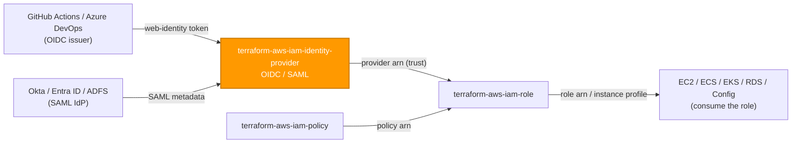
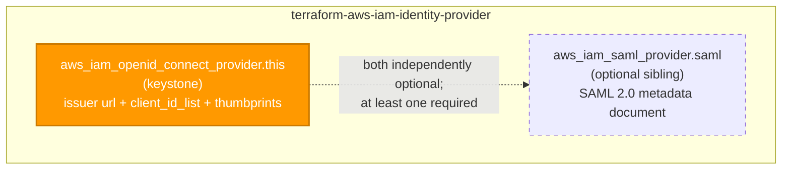

# 🟧 AWS **IAM Identity Provider** Terraform Module

> **Co-owns the account-level OIDC and SAML identity providers that federate external identities into AWS — so CI/CD pipelines and enterprise SSO assume IAM roles via short-lived tokens instead of long-lived access keys.** Built for the AWS provider **v6.x**.

[](https://www.terraform.io)
[](https://registry.terraform.io/providers/hashicorp/aws/latest)
[](#)
[](#)
[](#)

---

## 🧩 Overview

- 🔑 **Federation without static keys.** Creates an `aws_iam_openid_connect_provider` (the keystone) and/or an `aws_iam_saml_provider`, the account-level trust anchors that IAM roles reference by ARN.
- 🤖 **OIDC is the gold standard.** GitHub Actions / Azure DevOps assume roles via short-lived web-identity tokens (`sts:AssumeRoleWithWebIdentity`) — no AWS access keys stored in any pipeline.
- 🏢 **SAML when enterprise SSO is needed.** Co-manage an Okta / Entra ID / ADFS provider for console federation (`sts:AssumeRoleWithSAML`).
- 🧱 **Each provider independently optional.** Supply an `oidc` object, a `saml` object, or both — but **at least one** is required (a module managing nothing is a config error, not a no-op).
- 🚫 **No wildcard audience.** `client_id_list` is a required, non-empty input — the caller owns the trust boundary; nothing permissive is baked in.
- 🏷️ **Tags everywhere.** `var.tags` flows to both providers and merges with provider `default_tags`; per-provider `oidc.tags` / `saml.tags` refine it; the merged set is surfaced as `tags_all`.
- 🌐 **Global by nature.** IAM is region-less — no `region` variable, and provider ARNs carry no region segment.

> 💡 **Why it matters:** OIDC federation is the CI/CD gold standard. Pipelines assume roles via short-lived web-identity tokens, so there are **no static AWS keys to leak, rotate, or audit** — the single largest reduction in standing credential risk available to a regulated estate.

---

## ❤️ Support this project

If these Terraform modules have been helpful to you or your organization, I'd appreciate your support in any of the following ways:

- ⭐ **Star this repository** to help others discover this Terraform module.
- 🤝 **Connect with me on LinkedIn:** [linkedin.com/in/microsoftexpert](https://www.linkedin.com/in/microsoftexpert)
- ☕ **Buy me a coffee:** [buymeacoffee.com/microsoftexpert](https://buymeacoffee.com/microsoftexpert)

Whether it's a star, a professional connection, or a coffee, every gesture helps keep these modules actively maintained and continually improving. Thank you for being part of the community!

---

## 🗺️ Where this fits in the family

`terraform-aws-iam-identity-provider` is a **foundation module** — it consumes nothing from siblings, and it *emits* provider ARNs that `terraform-aws-iam-role` trust policies consume. It is the trust anchor that turns an external IdP into an assumable AWS identity.



---

## 🧬 What this module builds



| Resource | Count | Created when |
|---|---|---|
| `aws_iam_openid_connect_provider.this` | 0 or 1 | `oidc != null` (keystone) |
| `aws_iam_saml_provider.saml` | 0 or 1 | `saml != null` (optional sibling) |

> A validation enforces `oidc != null || saml != null` — at least one must be configured.

---

## ✅ Provider / Versions

| Requirement | Version |
|---|---|
| Terraform | `>= 1.12.0` |
| `hashicorp/aws` | `>= 6.0, < 7.0` |

The module declares only a `required_providers` block (`providers.tf`) and inherits the configured provider. There is **no `provider {}` block** and **no credential variable** — credentials resolve through the standard AWS chain at the root/pipeline level (env vars → SSO/shared credentials → `assume_role` → instance profile / IRSA → OIDC web identity).

---

## 🔑 Required IAM Permissions

Least-privilege actions the **Terraform execution identity** needs to manage this module.

| Action | Required for | Notes |
|---|---|---|
| `iam:CreateOpenIDConnectProvider`, `iam:DeleteOpenIDConnectProvider` | OIDC provider lifecycle | Only when an `oidc` object is supplied |
| `iam:GetOpenIDConnectProvider`, `iam:UpdateOpenIDConnectProviderThumbprint` | OIDC read / thumbprint rotation | Thumbprint update on `thumbprint_list` change |
| `iam:AddClientIDToOpenIDConnectProvider`, `iam:RemoveClientIDFromOpenIDConnectProvider` | OIDC audience (client ID) management | Applied on `client_id_list` changes |
| `iam:CreateSAMLProvider`, `iam:DeleteSAMLProvider`, `iam:UpdateSAMLProvider`, `iam:GetSAMLProvider` | SAML provider lifecycle | Only when a `saml` object is supplied |
| `iam:TagOpenIDConnectProvider`, `iam:UntagOpenIDConnectProvider` | OIDC tagging | Plus `iam:ListOpenIDConnectProviderTags` for read |
| `iam:TagSAMLProvider`, `iam:UntagSAMLProvider` | SAML tagging | Plus `iam:ListSAMLProviderTags` for read |

> ⚠️ **`iam:PassRole` is NOT a module permission.** Role trust is out of scope here — federated roles live in `terraform-aws-iam-role` and reference this module's provider ARN. No service-linked role and no `iam:CreateServiceLinkedRole` are involved.

> 🔒 Scope these actions to the provider ARN pattern (`arn:aws:iam::<account>:oidc-provider/*`, `arn:aws:iam::<account>:saml-provider/*`) so the deploy identity can only manage federation primitives, not roles.

---

## 📋 AWS Prerequisites

- **No service-linked role** is required to create an identity provider.
- **Global service.** IAM is region-less — do **not** set a `region` variable; provider ARNs have no region segment. The provider still needs *a* region configured to authenticate.
- **OIDC issuer reachability.** The OIDC `url` must be a valid HTTPS issuer endpoint matching the IdP's `iss` claim (e.g. `https://token.actions.githubusercontent.com`). For major IdPs (GitHub, GitLab, Google, Auth0, an S3-hosted JWKS) AWS validates against its own trusted CA library and any `thumbprint_list` value is retained but unused; omit it to let IAM auto-retrieve the thumbprint for other IdPs.
- **SAML metadata.** The SAML provider requires the IdP's federation metadata XML document (load with `file("metadata.xml")` or pass the XML string).
- **Quotas** (per [IAM and AWS STS quotas](https://docs.aws.amazon.com/IAM/latest/UserGuide/reference_iam-quotas.html)):
 - Default **100 OIDC providers** per account.
 - Default **100 SAML providers** per account.
- **Uniqueness.** One provider per unique issuer URL (OIDC) / metadata document name (SAML) per account.

---

## 📁 Module Structure

```
terraform-aws-iam-identity-provider/
├── providers.tf # required_providers (aws >= 6.0, < 7.0); no provider block
├── variables.tf # oidc → saml → tags (each provider independently optional)
├── main.tf # aws_iam_openid_connect_provider.this + aws_iam_saml_provider.saml
├── outputs.tf # id + arn (OIDC keystone) + saml_provider_arn + tags_all
├── README.md # this file
└── SCOPE.md # in/out-of-scope, IAM permissions, prerequisites, gotchas
```

---

## ⚙️ Quick Start

Smallest working call — a GitHub Actions OIDC provider for keyless CI/CD:

```hcl
module "github_oidc" {
  source = "git::https://github.com/microsoftexpert/terraform-aws-iam-identity-provider?ref=v1.0.0"

  oidc = {
    url            = "https://token.actions.githubusercontent.com"
    client_id_list = ["sts.amazonaws.com"]
  }

  tags = {
    Environment = "prod"
    CostCenter  = "1234"
  }
}

# Wire module.github_oidc.arn into a terraform-aws-iam-role assume_role_policy (see Example 9).
```

---

## 🔌 Cross-Module Contract

### Consumes

| Input | Type | Source module |
|---|---|---|
| (none — foundation provider) | — | — |

> **None — foundation module.** It needs no sibling output to function. The OIDC issuer URL / SAML metadata come from the external IdP, supplied by the caller.

### Emits

| Output | Description | Consumed by |
|---|---|---|
| `id` | OIDC provider id (its ARN); `null` when no `oidc` object | references / CLI |
| `arn` | OIDC provider ARN `arn:aws:iam::<account>:oidc-provider/<issuer-host>` — the cross-resource reference type; `null` when no `oidc` object | `terraform-aws-iam-role` web-identity trust policies |
| `oidc_url` | OIDC issuer URL | audit / wiring |
| `oidc_client_id_list` | Registered audiences (`aud`) | audit |
| `oidc_thumbprint_list` | Server-cert thumbprints (auto-retrieved when not pinned) | audit |
| `saml_provider_arn` | SAML provider ARN `arn:aws:iam::<account>:saml-provider/<name>`; `null` when no `saml` object | `terraform-aws-iam-role` SAML trust policies |
| `saml_provider_id` | SAML provider id (its ARN); `null` when no `saml` object | references |
| `saml_provider_name` | SAML provider name; `null` when no `saml` object | audit |
| `saml_provider_valid_until` | SAML metadata expiry (RFC1123); `null` when no `saml` object | rotation monitoring |
| `tags_all` | All tags incl. provider `default_tags` (OIDC's, else SAML's) | governance/audit |
| `saml_provider_tags_all` | All tags on the SAML provider; `null` when no `saml` object | governance/audit |

---

## 📚 Example Library

<details>
<summary><strong>1 · Minimal — GitHub Actions OIDC</strong></summary>

```hcl
module "github_oidc" {
  source = "git::https://github.com/microsoftexpert/terraform-aws-iam-identity-provider?ref=v1.0.0"

  oidc = {
    url            = "https://token.actions.githubusercontent.com"
    client_id_list = ["sts.amazonaws.com"]
  }
}
```
</details>

<details>
<summary><strong>2 · Azure DevOps OIDC (workload-identity federation)</strong></summary>

```hcl
module "ado_oidc" {
  source = "git::https://github.com/microsoftexpert/terraform-aws-iam-identity-provider?ref=v1.0.0"

  oidc = {
    url            = "https://vstoken.dev.azure.com/<org-id>"
    client_id_list = ["api://AzureADTokenExchange"]
  }
}
```
</details>

<details>
<summary><strong>3 · GitLab CI OIDC</strong></summary>

```hcl
module "gitlab_oidc" {
  source = "git::https://github.com/microsoftexpert/terraform-aws-iam-identity-provider?ref=v1.0.0"

  oidc = {
    url            = "https://gitlab.com"
    client_id_list = ["https://gitlab.com"]
  }
}
```
</details>

<details>
<summary><strong>4 · EKS cluster OIDC (IRSA — IAM Roles for Service Accounts)</strong></summary>

```hcl
module "irsa_oidc" {
  source = "git::https://github.com/microsoftexpert/terraform-aws-iam-identity-provider?ref=v1.0.0"

  oidc = {
    url            = module.eks.oidc_issuer_url # from terraform-aws-eks
    client_id_list = ["sts.amazonaws.com"]
  }
}
# Note: terraform-aws-eks can provision its own IRSA provider; create one here only
# when you manage the OIDC trust anchor separately from the cluster lifecycle.
```
</details>

<details>
<summary><strong>5 · OIDC with explicitly pinned thumbprint</strong></summary>

```hcl
module "custom_oidc" {
  source = "git::https://github.com/microsoftexpert/terraform-aws-iam-identity-provider?ref=v1.0.0"

  oidc = {
    url             = "https://oidc.internal.casey.example.com"
    client_id_list  = ["sts.amazonaws.com"]
    thumbprint_list = ["990f4193972f2becf12ddeda5237f9c952f20d9e"] # 40-char hex SHA-1
  }
}
# For a custom/private IdP, pin the CA thumbprint and rotate it deliberately
# when the IdP rotates its certificate (see Architecture Notes → thumbprint drift).
```
</details>

<details>
<summary><strong>6 · Multiple audiences on one OIDC provider</strong></summary>

```hcl
module "multi_aud_oidc" {
  source = "git::https://github.com/microsoftexpert/terraform-aws-iam-identity-provider?ref=v1.0.0"

  oidc = {
    url            = "https://token.actions.githubusercontent.com"
    client_id_list = ["sts.amazonaws.com", "https://github.com/FinancialPartners"]
  }
}
```
</details>

<details>
<summary><strong>7 · SAML-only — enterprise SSO into IAM</strong></summary>

```hcl
module "okta_saml" {
  source = "git::https://github.com/microsoftexpert/terraform-aws-iam-identity-provider?ref=v1.0.0"

  saml = {
    name                   = "corp-okta"
    saml_metadata_document = file("${path.module}/okta-metadata.xml")
  }
}
# id / arn are null (no OIDC). Consume module.okta_saml.saml_provider_arn downstream.
```
</details>

<details>
<summary><strong>8 · Both OIDC and SAML in one call</strong></summary>

```hcl
module "federation" {
  source = "git::https://github.com/microsoftexpert/terraform-aws-iam-identity-provider?ref=v1.0.0"

  oidc = {
    url            = "https://token.actions.githubusercontent.com"
    client_id_list = ["sts.amazonaws.com"]
  }

  saml = {
    name                   = "corp-entra"
    saml_metadata_document = file("${path.module}/entra-metadata.xml")
  }
}
```
</details>

<details>
<summary><strong>9 · Wire OIDC into a federated role (<code>terraform-aws-iam-role</code>)</strong></summary>

```hcl
module "github_oidc" {
  source = "git::https://github.com/microsoftexpert/terraform-aws-iam-identity-provider?ref=v1.0.0"
  oidc = {
    url            = "https://token.actions.githubusercontent.com"
    client_id_list = ["sts.amazonaws.com"]
  }
}

module "ci_deploy_role" {
  source = "git::https://github.com/microsoftexpert/terraform-aws-iam-role?ref=v1.0.0"

  name = "casey-ci-deploy"

  assume_role_policy = jsonencode({
    Version = "2012-10-17"
    Statement = [{
      Effect    = "Allow"
      Principal = { Federated = module.github_oidc.arn }
      Action    = "sts:AssumeRoleWithWebIdentity"
      Condition = {
        StringEquals = { "token.actions.githubusercontent.com:aud" = "sts.amazonaws.com" }
        StringLike   = { "token.actions.githubusercontent.com:sub" = "repo:FinancialPartners/*:ref:refs/heads/main" }
      }
    }]
  })
}
```
</details>

<details>
<summary><strong>10 · Wire SAML into an SSO role (<code>terraform-aws-iam-role</code>)</strong></summary>

```hcl
module "okta_saml" {
  source = "git::https://github.com/microsoftexpert/terraform-aws-iam-identity-provider?ref=v1.0.0"
  saml = {
    name                   = "corp-okta"
    saml_metadata_document = file("${path.module}/okta-metadata.xml")
  }
}

module "sso_admin_role" {
  source = "git::https://github.com/microsoftexpert/terraform-aws-iam-role?ref=v1.0.0"

  name = "casey-sso-admin"

  assume_role_policy = jsonencode({
    Version = "2012-10-17"
    Statement = [{
      Effect    = "Allow"
      Principal = { Federated = module.okta_saml.saml_provider_arn }
      Action    = "sts:AssumeRoleWithSAML"
      Condition = { StringEquals = { "SAML:aud" = "https://signin.aws.amazon.com/saml" } }
    }]
  })

  max_session_duration = 14400 # 4h for interactive console sessions
}
```
</details>

<details>
<summary><strong>11 · Tags (merge with provider <code>default_tags</code>)</strong></summary>

```hcl
# Caller's provider block owns default_tags; the module never sets it.
provider "aws" {
  default_tags { tags = { Owner = "platform", ManagedBy = "terraform" } }
}

module "tagged_oidc" {
  source = "git::https://github.com/microsoftexpert/terraform-aws-iam-identity-provider?ref=v1.0.0"

  oidc = {
    url            = "https://token.actions.githubusercontent.com"
    client_id_list = ["sts.amazonaws.com"]
  }

  tags = {
    Environment = "prod" # resource tag — wins over default_tags on key conflict
    DataClass   = "internal"
  }
}
# module.tagged_oidc.tags_all == { Owner, ManagedBy, Environment, DataClass }
```
</details>

<details>
<summary><strong>12 · Per-provider tag refinement (<code>oidc.tags</code> / <code>saml.tags</code>)</strong></summary>

```hcl
module "federation" {
  source = "git::https://github.com/microsoftexpert/terraform-aws-iam-identity-provider?ref=v1.0.0"

  tags = { Owner = "platform" } # module-level baseline

  oidc = {
    url            = "https://token.actions.githubusercontent.com"
    client_id_list = ["sts.amazonaws.com"]
    tags           = { Purpose = "cicd" } # wins over module-level on conflict
  }

  saml = {
    name                   = "corp-okta"
    saml_metadata_document = file("${path.module}/okta-metadata.xml")
    tags                   = { Purpose = "workforce-sso" }
  }
}
```
</details>

<details>
<summary><strong>13 · Reading the SAML metadata expiry for rotation monitoring</strong></summary>

```hcl
module "okta_saml" {
  source = "git::https://github.com/microsoftexpert/terraform-aws-iam-identity-provider?ref=v1.0.0"
  saml = {
    name                   = "corp-okta"
    saml_metadata_document = file("${path.module}/okta-metadata.xml")
  }
}

output "saml_metadata_expires" {
  value = module.okta_saml.saml_provider_valid_until # surface to your monitoring
}
```
</details>

<details>
<summary><strong>14 · End-to-end composition — keyless GitHub Actions deploy stack</strong></summary>

```hcl
# 1) Trust anchor — OIDC provider (this module)
module "github_oidc" {
  source = "git::https://github.com/microsoftexpert/terraform-aws-iam-identity-provider?ref=v1.0.0"
  oidc = {
    url            = "https://token.actions.githubusercontent.com"
    client_id_list = ["sts.amazonaws.com"]
  }
  tags = { Environment = "prod", Purpose = "cicd" }
}

# 2) Least-privilege deploy permissions
module "deploy_policy" {
  source = "git::https://github.com/microsoftexpert/terraform-aws-iam-policy?ref=v1.0.0"
  name   = "casey-ci-deploy"
  policy = data.aws_iam_policy_document.deploy.json
}

# 3) Role the pipeline assumes via web identity — no static keys anywhere
module "ci_deploy_role" {
  source = "git::https://github.com/microsoftexpert/terraform-aws-iam-role?ref=v1.0.0"

  name                = "casey-ci-deploy"
  managed_policy_arns = [module.deploy_policy.arn]

  assume_role_policy = jsonencode({
    Version = "2012-10-17"
    Statement = [{
      Effect    = "Allow"
      Principal = { Federated = module.github_oidc.arn }
      Action    = "sts:AssumeRoleWithWebIdentity"
      Condition = {
        StringEquals = { "token.actions.githubusercontent.com:aud" = "sts.amazonaws.com" }
        StringLike   = { "token.actions.githubusercontent.com:sub" = "repo:FinancialPartners/infra:ref:refs/heads/main" }
      }
    }]
  })

  tags = { Environment = "prod" }
}

# The GitHub Actions workflow uses aws-actions/configure-aws-credentials with
# role-to-assume = module.ci_deploy_role.arn — short-lived creds, zero stored secrets.
```
</details>

---

## 📥 Inputs

| Name | Type | Default | Description |
|---|---|---|---|
| `oidc` | `object({ url, client_id_list, thumbprint_list, tags })` | `null` | OIDC provider config. `url` and `client_id_list` required; **`url` is FORCE-NEW**. Leave `null` to manage no OIDC provider (then `saml` is required). |
| `saml` | `object({ name, saml_metadata_document, tags })` | `null` | SAML provider config. `name` and `saml_metadata_document` required; **`name` is FORCE-NEW**. Leave `null` to manage no SAML provider (then `oidc` is required). |
| `tags` | `map(string)` | `{}` | Tags for both providers (merge with provider `default_tags`; per-provider tags win over these). |

Validations enforce: at least one of `oidc`/`saml`; `oidc.url` begins with `https://`; `oidc.client_id_list` non-empty (no wildcard audience); each `thumbprint_list` entry is 40-char hex; `saml.name` matches `^[a-zA-Z0-9._-]{1,128}$`. See `variables.tf` for the full heredoc schemas.

---

## 🧾 Outputs

| Name | Description |
|---|---|
| `id` | OIDC provider id (its ARN); `null` when no `oidc`. |
| `arn` | OIDC provider ARN (cross-resource reference type); `null` when no `oidc`. |
| `oidc_url` / `oidc_client_id_list` / `oidc_thumbprint_list` | OIDC attributes; `null` when no `oidc`. |
| `saml_provider_arn` | SAML provider ARN (cross-resource reference type); `null` when no `saml`. |
| `saml_provider_id` / `saml_provider_name` | SAML attributes; `null` when no `saml`. |
| `saml_provider_valid_until` | SAML metadata expiry (RFC1123); `null` when no `saml`. |
| `tags_all` | All tags incl. provider `default_tags` (OIDC's when present, else SAML's). |
| `saml_provider_tags_all` | All tags on the SAML provider; `null` when no `saml`. |

> ℹ️ Many outputs are conditionally `null` by design — a SAML-only deployment leaves `id`/`arn` null (use `saml_provider_arn`), and vice versa. No secrets are emitted, so no output is marked `sensitive`.

---

## 🧠 Architecture Notes

- **ARN formats (the cross-resource reference type):**
 - OIDC: `arn:aws:iam::<account-id>:oidc-provider/<issuer-host-and-path>` (e.g. `.../token.actions.githubusercontent.com`).
 - SAML: `arn:aws:iam::<account-id>:saml-provider/<name>`.
 - IAM is **global** — **no region segment** in either ARN.
- **ID format:** for both resources the `id` *is* the ARN. Trust policies reference the ARN in `Principal.Federated`, paired with a `Condition` on the audience (`aud`) and subject (`sub`) claims (OIDC) or `SAML:aud` (SAML).
- **Force-new fields:** OIDC `url` (issuer) and SAML `name` both force replacement. Changing either destroys and recreates the provider — and breaks any role trust policy referencing the old ARN until re-applied. Treat the issuer URL / SAML name as immutable identity.
- **Thumbprint drift / rotation:** for major IdPs AWS validates against its trusted CA library, so an omitted `thumbprint_list` is the recommended default. If you pin thumbprints for a custom IdP and it rotates its CA certificate, `plan` will show drift — rotate the pinned value deliberately and re-apply; `iam:UpdateOpenIDConnectProviderThumbprint` is applied in place (not force-new).
- **`tags` ↔ `tags_all` ↔ `default_tags`:** `var.tags` is applied to each provider; per-provider `oidc.tags` / `saml.tags` merge on top (winning on key conflict); `tags_all` is the provider-computed merge of resource tags over provider `default_tags`, with **resource tags winning**. `default_tags` is configured in the caller's provider block — **never** inside this module.
- **Eventual consistency:** a freshly created provider may not be immediately usable by STS. A role that assumes via web identity / SAML created in the same apply can transiently fail until IAM propagation completes — this is expected, not a module defect.
- **Destroy ordering:** delete trusting roles (in `terraform-aws-iam-role`) before the provider, or roles will have a dangling `Principal.Federated` ARN. The provider itself has no dependent sub-resources to sequence.
- **us-east-1 globals:** N/A. IAM is region-less; this module never needs a region-pinned provider alias.

---

## 🧱 Design Principles

Secure-by-default posture and every opt-out, explicitly:

| Posture | Default | Opt-out |
|---|---|---|
| Federation model | OIDC web-identity (short-lived tokens) is the recommended path | enable the `saml` object for enterprise SSO |
| OIDC audiences | caller must specify `client_id_list` — **no wildcard audience baked in** | n/a (closed by design) |
| Thumbprints | omitted → AWS auto-validates major IdPs against trusted CAs | supply `thumbprint_list` to pin a custom IdP |
| Long-lived credentials | **none issued** — this module replaces static access keys | n/a |
| At-least-one provider | validation requires `oidc` or `saml` | n/a (a module managing nothing is an error) |
| Region | none (IAM is global) | n/a |

> Identity providers hold **no data at rest**, so encryption defaults are N/A. The secure posture here is **keyless federation + explicit audiences + no wildcard trust**. The single largest control is what this module *removes*: standing AWS access keys in pipelines.

Other principles:
- **One composite, two sibling primitives.** OIDC and SAML are account-level federation siblings; each is independently optional via its own object. The OIDC provider is the keystone (`id`/`arn` surface it).
- **`for_each` guards, never `count`.** Each provider materializes via a `for_each` over a one-or-zero map, so toggling one provider never churns the other.
- **Role trust is out of scope.** Federated roles live in `terraform-aws-iam-role` and reference this module's ARN — keeping the federation primitive decoupled from the roles that consume it.
- **Primary outputs `id` + `arn`**, plus the SAML ARN, full attributes, and `tags_all`.

---

## 🚀 Runbook

```powershell
# Validate without backend or credentials
terraform init -backend=false
terraform validate
terraform fmt -check
```

> `plan` / `apply` require valid AWS credentials (profile / SSO / OIDC) resolved through the standard provider chain, plus the IAM actions listed above. No region is needed for the resources — IAM is global — though the provider still requires *a* region to be configured.

> ⚠️ Pin the module source with `?ref=v1.0.0`, never a branch.

---

## 🧪 Testing

- `terraform init -backend=false && terraform validate` — schema + reference integrity.
- `terraform fmt -check` — canonical formatting.
- `terraform plan` against a sandbox account to confirm the provider(s) and tags materialize as expected.
- Assert `module.<name>.arn` (OIDC) and/or `saml_provider_arn` and `tags_all` in your root-module test harness, then wire the ARN into a `terraform-aws-iam-role` trust policy and confirm a test `sts:AssumeRoleWithWebIdentity` / `WithSAML` succeeds.

---

## 💬 Example Output

```text
module.github_oidc.aws_iam_openid_connect_provider.this["this"]: Creation complete after 1s
 [id=arn:aws:iam::123456789012:oidc-provider/token.actions.githubusercontent.com]

Outputs:
arn = "arn:aws:iam::123456789012:oidc-provider/token.actions.githubusercontent.com"
id = "arn:aws:iam::123456789012:oidc-provider/token.actions.githubusercontent.com"
oidc_url = "https://token.actions.githubusercontent.com"
tags_all = { "Environment" = "prod", "ManagedBy" = "terraform", "Owner" = "platform" }
```

---

## 🔍 Troubleshooting

| Symptom | Likely cause | Fix |
|---|---|---|
| `EntityAlreadyExists` on OIDC create | An OIDC provider for this issuer URL already exists in the account | Import the existing provider, or reference it via a data source — one provider per issuer per account |
| `EntityAlreadyExists` on SAML create | A SAML provider with this `name` already exists | Use a different `name` or import the existing one |
| `Error: at least one identity provider must be configured` | Both `oidc` and `saml` left `null` | Supply at least one object (validation guard) |
| `oidc.client_id_list must contain at least one audience` | Empty `client_id_list` | Provide the IdP's audience (e.g. `["sts.amazonaws.com"]`) — no wildcard is permitted |
| `thumbprint` must be 40-char hex | Malformed `thumbprint_list` entry | Use the SHA-1 cert thumbprint as 40 hex chars, or omit to auto-retrieve |
| `AccessDenied: sts:AssumeRoleWithWebIdentity` from a role | Trust policy `aud`/`sub` condition doesn't match the token, or provider ARN mismatch | Verify `Principal.Federated` = this module's `arn` and the `:sub` claim matches the repo/branch |
| `InvalidIdentityToken` right after create | IAM eventual-consistency propagation lag | Re-run; the provider needs a moment to propagate to STS |
| Tag drift on every plan | A tag also set by provider `default_tags` with a different value | Let resource tags win, or remove the overlap from `default_tags` |
| `AccessDenied: iam:CreateOpenIDConnectProvider` | Deploy identity lacks the federation actions | Grant the actions in 🔑 Required IAM Permissions, scoped to the provider ARN pattern |
| SAML logins fail after metadata change | Stale or expired `saml_metadata_document` | Refresh the XML from the IdP; check `saml_provider_valid_until` |

---

## 🔗 Related Docs

- [Creating OpenID Connect (OIDC) identity providers](https://docs.aws.amazon.com/IAM/latest/UserGuide/id_roles_providers_create_oidc.html)
- [Creating IAM SAML identity providers](https://docs.aws.amazon.com/IAM/latest/UserGuide/id_roles_providers_create_saml.html)
- [Configuring OpenID Connect in GitHub Actions / AWS](https://docs.github.com/en/actions/deployment/security-hardening-your-deployments/configuring-openid-connect-in-amazon-web-services)
- [IAM and AWS STS quotas](https://docs.aws.amazon.com/IAM/latest/UserGuide/reference_iam-quotas.html)
- Terraform: [`aws_iam_openid_connect_provider`](https://registry.terraform.io/providers/hashicorp/aws/latest/docs/resources/iam_openid_connect_provider) · [`aws_iam_saml_provider`](https://registry.terraform.io/providers/hashicorp/aws/latest/docs/resources/iam_saml_provider)
- Sibling modules: `terraform-aws-iam-role`, `terraform-aws-iam-policy`, `terraform-aws-iam-identity-center`, `terraform-aws-eks`
- Module internals: `SCOPE.md`

---

> 🧡 *"Infrastructure as Code should be standardized, consistent, and secure."*
